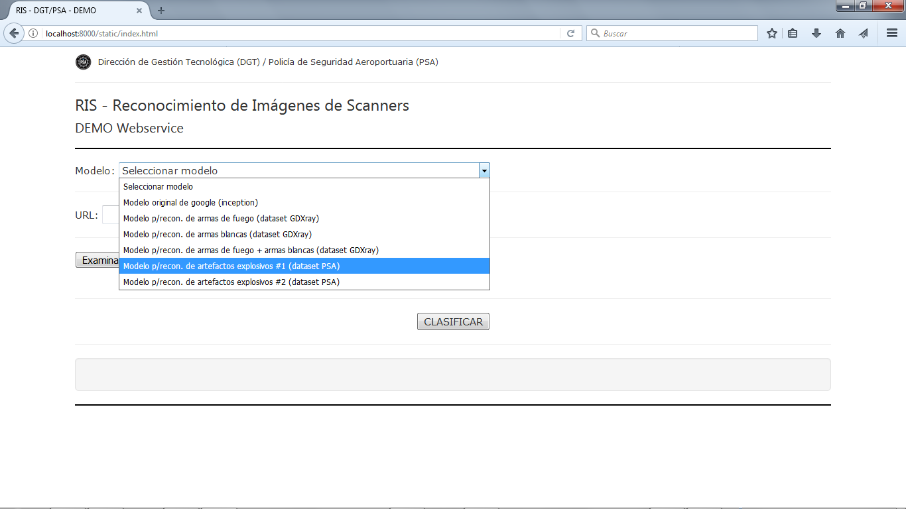
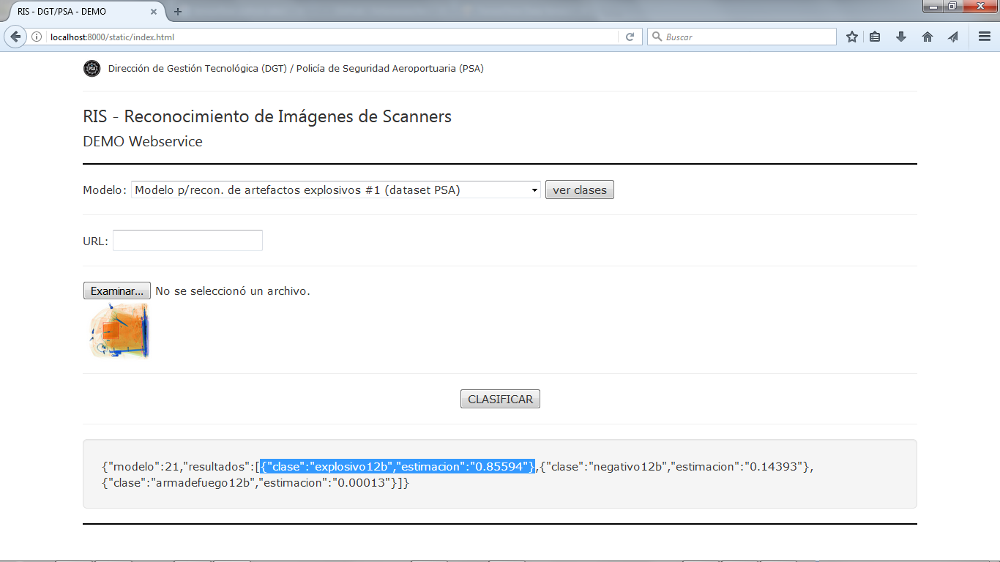
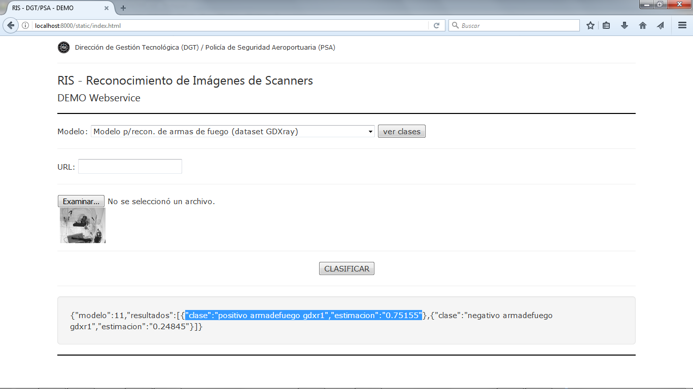

# Webservice para la clasificación de imágenes de scanners

Proyecto de investigacion y desarrollo, actualmente en curso, de la Dirección de Gestión Tecnológica (DGT) de la Polícia de Seguridad Aeroportuaria (PSA). Dados los importantes avances recientes en el reconocimiento de imágenes computarizado, y la disponibilidad de software libre que facilita la aplicación práctica de estas técnicas, el proyecto propone la implementación de un sistema que, conectado al equipamiento de rayos-x para el escaneo de equipaje actualmente utilizado por la PSA, tendrá por objetivo principal reconocer automáticamente imágenes obtenidas desde los scanners para alertar al operador acerca imágenes identificadas como amenazas (artefactos explosivos, armas de fuego, armas blancas, etc.)
Aunque desde hace años existe literatura específica, es decir, papers que tratan acerca del reconocimiento de imágenes de rayos en busca de amenazas como las citadas más arriba, los datasets o conjuntos de imágenes utilizados en la mayoría de esas publicaciones, son reservados. Otro factor que dificulta repetir los experimientos publicados es contar el software necesario o la capacidad de desarrollarlo.
Teniendo en cuenta lo anterior, con la intención de confirmar la factibilidad del proyecto de la DGT, y poder determinar si el umbral o margen de precisión de las estimaciones que genere resulten aceptables, se realizaron pruebas tanto sobre imágenes obtenidas desde los scanners de la PSA particularmente, como sobre otros conjuntos de imágenes en el dominio público, y se decidió utilizar la librería de software libre TensorFlow, de Google.
Se publican en github las instrucciones y el código fuente del webservice (que "clasifica" imágenes que le son pasadas como entrada), scripts auxiliares e información adicional para poder repetir las pruebas con los conjuntos de imágenes disponibles abiertamente.

Áreas en que se enmarca el proyecto: Informática, inteligencia artificial, aprendizaje automático o machine learning, redes neuronales, redes neuronales profundas, visión computarizada, reconocimiento computarizado de imágenes.

Palabras clave: control de equipaje, imágenes de rayos x, seguridad en aeropuertos, detección de explosivos, detección de armas de fuego, reconocimiento de imágenes, aprendizaje automático (machine learning), redes neuronales profundas (deep neural networks).


## Obtención de estimaciones a partir de modelos generados

### Instalación de TensorFlow en Linux

Las pruebas han sido realizadas en en un Ubuntu server 14.04, para Python 2.7 y en base a lo indicado en https://www.tensorflow.org/install/install_linux#InstallingVirtualenv (donde pueden encontrarse alternativas y más información; ver especialmente si se cuenta con placa/s nVidia):

```
$ sudo apt-get install python-pip python-dev python-virtualenv
$ git clone https://github.com/dgt-psa/ris
$ cd ris
$ virtualenv --system-site-packages venv
$ source venv/bin/activate
(venv)$ pip install --upgrade pip
(venv)$ pip install tensorflow
```

### Instalación del resto de dependencias del webservice

```
(venv)$ pip install Flask
(venv)$ pip install gunicorn
(venv)$ pip install pillow
```

### Arranque del webservice

Para probar el webservice, posicionado en la carpeta "webservice", puede ejecutarse:

```
(venv)$ cd webservice
(venv)$ gunicorn --bind 0.0.0.0:8000 wsgi:app
```

Luego, abrir un navegador para ingresar a http://localhost:8000.


## Generación de nuevos modelos

### Re-entrenamiento de última capa o etapa del modelo *inception* de Google

Se recomienda seguir los pasos detallados en https://www.tensorflow.org/tutorials/image_retraining.
Alternativamente, si ya se cuenta con el entorno virtual instalado de acuerdo a lo indicado en lo anterior (para probar el webservice), se sugiere clonar el repositorio de tensorflow para utilizar el equivalente python para el entranamiento, así por ejemplo, para generar un modelo utilizando el dataset (conjunto de imágenes organizadas por clase por carpeta) en /home/usuario/imagenes/gdxr1:

```
(venv)$ git clone https://github.com/tensorflow/tensorflow
(venv)$ cd tensorflow/tensorflow
(venv)$ python ./examples/image_retraining/retrain.py \
  --bottleneck_dir=/home/usuario/retrain/bottlenecks \
  --how_many_training_steps=500 \
  --model_dir=/home/usuario/retrain/inception \
  --summaries_dir=/home/usuario/retrain/training_summaries/basic \
  --output_graph=/home/usuario/retrain/retrained_graph.pb \
  --output_labels=/home/usuario/retrain/retrained_labels.txt \
  --image_dir=/home/usuario/imagenes/gdxr1
```

Lo generará una salida similar a la siguiente:

```
[...]

Creating bottleneck at /home/usuario/retrain/bottlenecks/negativo_armadefuego_gdxr1/B0056_1062.png.jpg.txt
Creating bottleneck at /home/usuario/retrain/bottlenecks/negativo_armadefuego_gdxr1/B0052_0078.png.jpg.txt
Creating bottleneck at /home/usuario/retrain/bottlenecks/negativo_armadefuego_gdxr1/B0057_0662.png.jpg.txt
2017-05-25 21:32:03.368619: Step 0: Train accuracy = 58.0%
2017-05-25 21:32:03.369174: Step 0: Cross entropy = 0.629190
2017-05-25 21:32:03.471703: Step 0: Validation accuracy = 48.0% (N=100)
2017-05-25 21:32:05.551229: Step 10: Train accuracy = 94.0%
2017-05-25 21:32:05.551856: Step 10: Cross entropy = 0.418225
2017-05-25 21:32:05.646887: Step 10: Validation accuracy = 94.0% (N=100)

[...]

2017-05-25 21:32:57.997663: Step 490: Train accuracy = 100.0%
2017-05-25 21:32:57.998142: Step 490: Cross entropy = 0.044950
2017-05-25 21:32:58.093207: Step 490: Validation accuracy = 98.0% (N=100)
2017-05-25 21:32:59.005286: Step 499: Train accuracy = 99.0%
2017-05-25 21:32:59.005836: Step 499: Cross entropy = 0.063496
2017-05-25 21:32:59.104612: Step 499: Validation accuracy = 99.0% (N=100)
Final test accuracy = 98.0% (N=939)
Converted 2 variables to const ops.
(venv)$
```

Si en cambio se especificaran 5000 pasos de entrenamiento (en lugar de 500), la salida se parecerá más a lo que sigue:

```
[...]

2017-05-25 22:41:41.112076: Step 4980: Train accuracy = 100.0%
2017-05-25 22:41:41.112577: Step 4980: Cross entropy = 0.014437
2017-05-25 22:41:41.204955: Step 4980: Validation accuracy = 100.0% (N=100)
2017-05-25 22:41:42.130347: Step 4990: Train accuracy = 100.0%
2017-05-25 22:41:42.130902: Step 4990: Cross entropy = 0.009582
2017-05-25 22:41:42.222196: Step 4990: Validation accuracy = 100.0% (N=100)
2017-05-25 22:41:43.074825: Step 4999: Train accuracy = 100.0%
2017-05-25 22:41:43.075330: Step 4999: Cross entropy = 0.005883
2017-05-25 22:41:43.167414: Step 4999: Validation accuracy = 100.0% (N=100)
Final test accuracy = 99.3% (N=939)
Converted 2 variables to const ops.
(venv)$
```

Los archivos generados de esta forma ("retrained_labels.txt" y "retrained_graph.pb") son lo que podrán utilizarse (configurándolos en un nuevo modelo en el archivo "ws_configuracion.py") desde el webservice.

## Capturas de Pantalla

### Webservice DEMO

Capturas de pantalla de la pagina demo para probar funcionamiento del webservice.








## Autores

Lic. Ariel Maiorano <amaiorano@psa.gob.ar>

Ing. Pablo Lázaro <plazaro@psa.gob.ar>

Dirección de Gestión Tecnológica (DGT) de la Polícia de Seguridad Aeroportuaria (PSA)

## Contributentes

## Agradecimientos

## Licencia

RIS - Reconocimiento de Imágenes de Scanners - Copyright (C) DGT/PSA 2017

This program is free software: you can redistribute it and/or modify it under the terms of the GNU General Public License as published by the Free Software Foundation, either version 3 of the License, or (at your option) any later version.

This program is distributed in the hope that it will be useful, but WITHOUT ANY WARRANTY; without even the implied warranty of MERCHANTABILITY or FITNESS FOR A PARTICULAR PURPOSE. See the GNU General Public License for more details.

You should have received a copy of the GNU General Public License along with this program. If not, see http://www.gnu.org/licenses/.

## Disclaimer

Como fuera mencionado, éste se trata de un proyecto de investigacion y desarrollo actualmente en curso. No deben considerarse completas ni correctas las funcionalidades implementadas al momento. Se advierte que encontrándose en estapa de prueba de factibilidad, la versión actual no cuenta con mecanismos de seguridad necesarios para la operación segura del sistema; en tal sentido, debe considerarse como un prototipo para evaluar únicamente si resultan o no aceptables los resultados o estimaciones que el sistema proporciona.

EL SOFTWARE SE PROPORCIONA "TAL COMO ESTÁ", SIN GARANTÍA DE NINGÚN TIPO, EXPRESA O IMPLÍCITA. EN NINGÚN CASO, LOS AUTORES SERÁN RESPONSABLES DE CUALQUIER RECLAMACIÓN, DAÑO U OTRA RESPONSABILIDAD, QUE SURJA DE O EN RELACIÓN CON EL SOFTWARE O EL USO DEL MISMO.

## Fuentes y referencias

```
https://www.tensorflow.org/get_started/
https://www.tensorflow.org/get_started/mnist/beginners
https://www.tensorflow.org/get_started/mnist/pros
https://www.tensorflow.org/programmers_guide/
https://www.tensorflow.org/programmers_guide/dims_types
https://www.tensorflow.org/programmers_guide/reading_data
https://www.tensorflow.org/programmers_guide/data_versions
https://www.tensorflow.org/tutorials/
https://www.tensorflow.org/tutorials/image_recognition
https://www.tensorflow.org/tutorials/image_retraining
https://www.tensorflow.org/tutorials/deep_cnn
https://www.tensorflow.org/api_docs/
https://www.tensorflow.org/api_guides/python/
https://www.tensorflow.org/extend/language_bindings
https://www.tensorflow.org/extend/architecture
http://dmery.ing.puc.cl/index.php/material/gdxray/
https://cloud.google.com/blog/big-data/2017/01/learn-tensorflow-and-deep-learning-without-a-phd
https://github.com/martin-gorner/tensorflow-mnist-tutorial
http://code-labs.cn/codelabs/tensorflow-for-poets/index.html
https://thenewstack.io/machine-learning-10-lines-code/
https://hackaday.io/project/20448-elephant-ai/log/56896-retraining-tensorflow-inception-v3-using-tensorflow-slim-part-1
https://indico.io/blog/tensorflow-data-inputs-part1-placeholders-protobufs-queues/
https://www.kernix.com/blog/image-classification-with-a-pre-trained-deep-neural-network_p11
https://medium.com/emergent-future/recognising-beer-with-tensorflow-9dedfee3c3c0
https://surajvantigodi.wordpress.com/2016/06/30/tensorflow-based-machine-translation/
https://github.com/tensorflow/tensorflow/blob/master/tensorflow/examples/image_retraining/retrain.py
https://github.com/tensorflow/models/tree/master/slim
https://github.com/hetaoaoao/tensorflow_web_deploy
https://github.com/aymericdamien/TensorFlow-Examples
```
